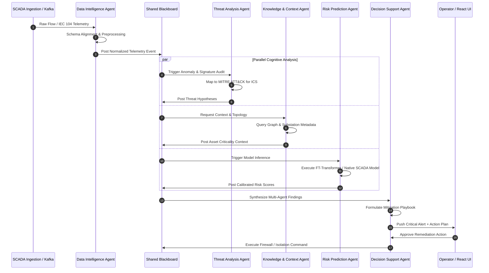

<div align="center">

# 🛡️ ARGUS: Autonomous Risk-Aware Grid Understanding & Security

### *A Production-Grade Multi-Agent Cognitive Platform & Controlled Cross-Domain Benchmark for Critical Energy Infrastructure Cybersecurity*

[](https://www.python.org/)
[](https://pytorch.org/)
[](https://fastapi.tiangolo.com/)
[](https://react.dev/)
[](https://www.typescriptlang.org/)
[](https://www.docker.com/)
[](LICENSE)
[](experiment_execution/neural_robustness/native_high_performance/reports/NR04_LEAKAGE_AUDIT.md)

[**Key Features**](#-key-features) •
[**System Architecture**](#-system-architecture) •
[**Multi-Agent Defense**](#-multi-agent-defense-engine) •
[**Empirical Benchmark Suite**](#-empirical-benchmark-suite--scientific-evidence) •
[**Quick Start**](#-quick-start) •
[**Streaming Pipeline**](#-streaming--replay-engine) •
[**About**](#-about-argus)

---

</div>

## 📌 Executive Overview

**ARGUS** (**A**utonomous **R**isk-aware **G**rid **U**nderstanding & **S**ecurity) is a dual-purpose enterprise cybersecurity framework and scientific benchmark designed for Industrial Control Systems (ICS), Operational Technology (OT), and Smart Grid electrical infrastructure. 

Operating at the intersection of **Multi-Agent Autonomous Systems**, **Deep Tabular Representation Learning**, and **Transferability Theory**, ARGUS addresses the acute resilience gap in modern critical infrastructure: *How can automated defense systems accurately detect novel, evasive cyber attacks across heterogeneous telemetry domains without suffering representation collapse or false alarm storms?*

ARGUS couples a **5-Agent Collaborative Reasoning Engine** operating over a shared blackboard with an **Empirical Cross-Domain Evidence Base** evaluating tree-based models, Deep Tabular Transformers (FT-Transformer), Covariance Alignment (CORAL), Domain-Adversarial Neural Networks (DANN), and Native SCADA high-dimensional telemetry across $3.57\text{M}+$ industrial network flows.

---

## ⚡ Key Features

- 🧠 **Collaborative Multi-Agent Architecture**: Five specialized AI agents (Data Intelligence, Threat Analysis, Knowledge & Context, Risk Prediction, Decision Support) communicating asynchronously via a high-speed Blackboard and Message Bus.
- 🔬 **Rigorously Audited Scientific Benchmark**: End-to-end reproducible research pipeline spanning 10 controlled experiments, multi-seed statistical significance suites, SHAP explainability, and certified zero-leakage test harnesses ($N=714,453$ frozen test records).
- 🌐 **Model Context Protocol (MCP) Integration**: Extensible tool execution layer enabling dynamic threat lookup, CVE querying, topological graph retrieval, and firewall rule orchestration.
- ⚡ **Sub-Millisecond Telemetry Streaming**: Event-driven ingestion and PCAP/Flow replay pipeline with sliding-window feature aggregation and automated schema alignment.
- 🛡️ **Zero-Trust Security & Audit Subsystem**: Cryptographic message signing, granular RBAC, automatic telemetry masking, and tamper-evident audit logging for NERC-CIP compliance.
- 🖥️ **Next-Gen SOC Dashboard**: Real-time React 19 / Vite interface with interactive network topology canvas, MITRE ATT&CK matrix visualization, live alert feeds, and human-in-the-loop remediation controls.

---

## 🏛 System Architecture

```
┌────────────────────────────────────────────────────────────────────────────────────────┐
│                               REACT 19 SOC DASHBOARD                                  │
│                 (Live Threat Feed · Topology Canvas · MITRE ATT&CK Matrix)             │
└───────────────────────────────────────────┬────────────────────────────────────────────┘
                                            │ WebSocket / HTTP REST (JWT / RBAC)
┌───────────────────────────────────────────▼────────────────────────────────────────────┐
│                                   FASTAPI CORE BACKEND                                 │
├────────────────────────────────────────────────────────────────────────────────────────┤
│  ┌───────────────────────┐  ┌──────────────────────┐  ┌─────────────────────────────┐  │
│  │   Agent Orchestrator  │  │ Agent Registry (IoC) │  │  Security & Cryptography    │  │
│  └───────────┬───────────┘  └──────────┬───────────┘  └──────────────┬──────────────┘  │
│              │                         │                             │                 │
│  ┌───────────▼─────────────────────────▼─────────────────────────────▼──────────────┐  │
│  │                            SHARED BLACKBOARD & EVENT BUS                         │  │
│  │              (State Store · Event Pub/Sub · Working / Ephemeral Memory)          │  │
│  └───────────┬───────────────────────────────────────────────────────┬──────────────┘  │
│              │                                                       │                 │
│  ┌───────────▼───────────────────────────────────────────────────────▼──────────────┐  │
│  │                                 AI AGENT SWARM                                   │  │
│  │  ┌──────────────┐ ┌──────────────┐ ┌──────────────┐ ┌──────────────┐ ┌─────────┐  │  │
│  │  │Data Intel    │ │Threat Analys.│ │Knowledge Ctx │ │Risk Predict  │ │Decision │  │  │
│  │  │(Ingest/Norm) │ │(MITRE / Anom)│ │(Graph / RAG) │ │(ML Scoring)  │ │Support  │  │  │
│  │  └───────┬──────┘ └───────┬──────┘ └───────┬──────┘ └───────┬──────┘ └────┬────┘  │  │
│  └──────────┼────────────────┼────────────────┼────────────────┼─────────────┼───────┘  │
│             │                │                │                │             │          │
│  ┌──────────▼────────────────▼────────────────▼────────────────▼─────────────▼──────┐  │
│  │                         TOOL EXECUTION & MCP SERVER LAYER                        │  │
│  │    (Shodan · NVD · MITRE ATT&CK · Graph Query · Firewall Rule Orchestrator)     │  │
│  └───────────────────────────────────┬──────────────────────────────────────────────┘  │
│                                      │                                                 │
│  ┌───────────────────────────────────▼──────────────────────────────────────────────┐  │
│  │                             PERSISTENCE & VECTOR STORE                           │  │
│  │           SQLite / PostgreSQL (Relational)  ·  ChromaDB (Vector Embeddings)       │  │
│  └──────────────────────────────────────────────────────────────────────────────────┘  │
└────────────────────────────────────────────────────────────────────────────────────────┘
```

---

## 🤖 Multi-Agent Defense Engine

ARGUS coordinates **five specialized cognitive agents**, each adhering to a strict 10-method lifecycle contract (`initialize`, `observe`, `analyze`, `reason`, `plan`, `act`, `verify`, `reflect`, `publish`, `teardown`):



### Agent Roster & Specializations

| Agent | Responsibility | Core Capabilities & Tools |
| :--- | :--- | :--- |
| 📡 **Data Intelligence** | Ingestion & Standardization | Multi-format parsing (PCAP, NetFlow, IEC 104 APDU), schema mapping, imputation, outlier suppression. |
| 🔍 **Threat Analysis** | Pattern Recognition & Attribution | MITRE ATT&CK matrix mapping, signature correlation, stealth command detection. |
| 📚 **Knowledge & Context** | Semantic Graph Retrieval | Substation topology queries, asset criticality indexing, vector store (ChromaDB) similarity lookups. |
| 📊 **Risk Prediction** | Probabilistic Threat Quantification | Deep tabular inference, calibrated probability estimation, operational false alarm constraint checking. |
| 🎯 **Decision Support** | Action Synthesis & Execution | Playbook generation, automated isolation planning, blast-radius estimation, human-in-the-loop dispatch. |

---

## 📊 Empirical Benchmark Suite & Scientific Evidence

ARGUS includes an exhaustive experimental suite evaluating cross-domain transfer and in-domain ceilings across three major cybersecurity datasets:
- **$D_1$ (Source)**: `CICIoT2023` ($N = 1,000,000$) — High-volume Internet of Things telemetry.
- **$D_2$ (Transfer Target)**: `ToN_IoT` ($N = 500,000$) — Multi-source heterogeneous IoT/IIoT captures.
- **$D_3$ (Target SCADA)**: `IEC 60870-5-104` ($N = 3,572,265$, Frozen Test $N = 714,453$) — Electrical power transmission SCADA telemetry.

### 🏆 Master Cross-Domain & Native Progression Matrix

```
Transfer Direction: Source D1 (CICIoT2023) ──► Target D3 (IEC 60870-5-104 Frozen Test N = 714,453)
```

| ID | Model Architecture | Representation | Training Regime | ROC-AUC | Average Precision ($AP$) | Calibrated $F_1$ | Calibrated MCC | Recall @ 0.1% FPR | Recall @ 1.0% FPR |
| :---: | :--- | :--- | :--- | :---: | :---: | :---: | :---: | :---: | :---: |
| **`EXP-01`** | LightGBM GBDT | ARGUS-4 | Zero-Shot Transfer | 0.6087 | 0.2989 | 0.3697 | 0.0543 | 0.00% | 0.00% |
| **`NR-01`** | FT-Transformer (`FTT-SMALL`) | ARGUS-4 | Zero-Shot Transfer | 0.6075 | 0.2978 | 0.3724 | 0.0652 | 0.00% | 0.03% |
| **`CAP-01`** | FT-Transformer (`FTT-LARGE`) | ARGUS-4 | Zero-Shot Transfer | 0.5100 | 0.1797 | 0.3803 | 0.0908 | 0.00% | 0.00% |
| **`DA-01`** | CORAL Covariance Alignment | ARGUS-4 | Domain Adaptation | 0.4441 | 0.2115 | 0.3724 | 0.0652 | 0.00% | 0.00% |
| **`DA-02`** | DANN Adversarial ($\lambda^*=0.50$) | ARGUS-4 | Domain Adaptation | 0.5961 | 0.2679 | 0.3828 | 0.1034 | 0.12% | 1.20% |
| **`REP-06`** | FT-Transformer | ARGUS-6 | Zero-Shot Transfer | 0.5652 | 0.2547 | 0.3724 | 0.0652 | 0.00% | 0.00% |
| **`REP-08`** | FT-Transformer | ARGUS-8 | Zero-Shot Transfer | 0.4448 | 0.2209 | 0.3669 | 0.0000 | 0.00% | 0.00% |
| **`NR-04`** | **`FTT-SMALL Native`** | Native SCADA (70) | **In-Domain Ceiling** | **0.6438** | **0.3636** | **0.4306** | **0.2397** | **7.16%** | **8.41%** |
| **`NR-04`** | **`FTT-MEDIUM Native`** | Native SCADA (70) | **In-Domain Ceiling** | **0.6461** | **0.3417** | **0.4300** | **0.2354** | **7.20%** | **7.32%** |
| **`NR-04`** | **`FTT-LARGE Native` (5 Seeds)** | Native SCADA (70) | **In-Domain Ceiling** | **0.6460 ± 0.002** | **0.3513 ± 0.007** | **0.4303** | **0.2383** | **7.22%** | **8.11%** |
| **`NR-04`** | **`LightGBM Native`** | Native SCADA (70) | **In-Domain Ceiling** | **0.6744** | **0.4066** | **0.4354** | **0.2494** | **8.95%** | **10.42%** |

### 🔬 Core Scientific Conclusions

1. **The Representation Bottleneck Theorem**:
   Cross-domain transfer performance collapses not due to neural capacity deficits (increasing parameters from 17k to 200k in `CAP-01` actually worsened AUC from $0.6075 \to 0.5100$) or unaligned distributions (CORAL failed at $0.4441$), but because **4-feature harmonization strips protocol-specific flow telemetry**. 
2. **Empirical In-Domain Ceiling**:
   Restoring full 70-dimensional native SCADA telemetry restores low-FPR operational detection (**$7.22\%$ recall at $0.1\%$ FPR** with **$97.01\%$ precision** vs. **$0.00\%$** in cross-domain models), establishing the empirical ceiling at $\text{ROC-AUC} \approx 0.674$ and $\text{AP} \approx 0.407$.
3. **Certified Zero Data Leakage**:
   All 9 leakage audit checklist items passed verification. Normalization scalers, threshold calibrations ($\theta^*$), and architecture sweeps were strictly isolated to training and calibration splits.

---

## 🚀 Quick Start

### Prerequisites
- **Python**: `3.11` or `3.12`
- **Node.js**: `20+` or `22+`
- **Hardware Acceleration**: Apple Silicon MPS / NVIDIA CUDA / CPU

### 1. Clone & Environment Setup

```bash
# Clone the ARGUS repository
git clone https://github.com/Bhumi-2303/ARGUS.git
cd ARGUS

# Set up Python virtual environment
python3 -m venv .venv
source .venv/bin/activate

# Install package dependencies in editable mode
pip install -e ".[dev,test]"
```

### 2. Configuration

```bash
# Generate development environment configuration
cp .env.example .env

# Initialize local SQLite database & seed metadata
python scripts/init_db.py
```

### 3. Launch Backend API Server

```bash
# Launch FastAPI server with auto-reload (Port 8000)
uvicorn src.argus.main:app --reload --host 0.0.0.0 --port 8000
```
*Interactive Swagger Documentation*: [`http://localhost:8000/docs`](http://localhost:8000/docs)  
*ReDoc Specification*: [`http://localhost:8000/redoc`](http://localhost:8000/redoc)

### 4. Launch React SOC Dashboard

```bash
# Open a second terminal window
cd frontend
npm install
npm run dev
```
*Access SOC Dashboard*: [`http://localhost:5173`](http://localhost:5173)

---

## 📡 Streaming & Replay Engine

ARGUS includes a high-throughput PCAP and flow replay producer to simulate live SCADA substation telemetry:

```bash
# Stream IEC 60870-5-104 flow data in real-time
python streaming/replay_producer.py \
  --input data/IEC104/extracted_csvs/ \
  --rate 500 \
  --target http://localhost:8000/api/v1/telemetry/ingest

# Run end-to-end streaming test
python streaming/test_streaming.py
```

---

## 📁 Repository Structure

```
ARGUS/
├── config/                                  # Centralized configuration (YAML & Pydantic settings)
├── experiment_execution/                    # Comprehensive Empirical Benchmark Evidence Base
│   ├── baseline_models/                     # EXP-01 to EXP-04 GBDT Baselines
│   └── neural_robustness/                   # Neural Robustness & Domain Adaptation Suite
│       ├── domain_adaptation/               # DA-01 (CORAL) & DA-02 (DANN Adversarial)
│       ├── native_high_performance/         # NR-04 Native SCADA Benchmark (70 Features)
│       │   ├── configs/                     # Reproducibility run configurations
│       │   ├── figures/                     # 12 Publication Figures (300 DPI) & CSVs
│       │   ├── reports/                     # Leakage Audit, Error Analysis, Final Report
│       │   ├── scripts/                     # run_nr04_benchmark.py pipeline
│       │   └── tables/                      # Multi-Seed & Master Comparison CSVs
│       └── native_representation/           # NR-03 Representation Cardinality Suite
├── frontend/                                # React 19 SOC Frontend (TypeScript, Tailwind, Lucide)
│   ├── src/
│   │   ├── components/                      # UI Components (TopologyCanvas, ThreatFeed, etc.)
│   │   ├── pages/                           # SOC Views (Dashboard, Analytics, Playbooks)
│   │   └── services/                        # WebSocket and REST Client API
├── src/argus/                               # Core ARGUS Python Package
│   ├── agents/                              # 5 Cognitive Agent implementations
│   ├── api/                                 # FastAPI REST endpoints & WebSocket handlers
│   ├── blackboard/                          # Shared Memory Blackboard & Pub/Sub Event Bus
│   ├── core/                                # BaseAgent contracts & abstract definitions
│   ├── orchestrator/                        # Adaptive task scheduling & DAG routing
│   ├── repositories/                        # Relational & Vector DB access layers
│   ├── schemas/                             # Pydantic data schemas & message envelopes
│   ├── security/                            # JWT, RBAC, Signature Verification & Audit
│   └── tools/                               # Tool Registry & MCP integration
├── streaming/                               # Real-Time Telemetry & Replay Engine
├── tests/                                   # Full Test Suite (Unit, Security, Integration)
└── docs/                                    # Architectural & Protocol Documentation
```

---

## 🧪 Testing Suite

ARGUS maintains high code quality and test coverage:

```bash
# Run entire test suite with coverage
pytest tests/ -v --cov=src/argus --cov-report=term-missing

# Run specific testing modules
pytest tests/agents/ -v        # Agent contract & lifecycle tests
pytest tests/security/ -v      # Cryptographic signing & RBAC tests
pytest tests/integration/ -v   # End-to-end blackboard & bus tests
```

---

## 📖 About ARGUS

### The Vision
Critical energy infrastructure is increasingly vulnerable to sophisticated nation-state cyber attacks. Legacy Signature-Based Intrusion Detection Systems (NIDS) fail against zero-day exploits, while black-box Deep Learning systems generate crippling false alarm rates or collapse when deployed across heterogeneous substations.

**ARGUS** was created to bridge this divide:
1. **Autonomous Cognitive Collaboration**: Replacing brittle single-model classifiers with a team of specialized AI agents that cross-examine evidence, verify topology, and synthesize human-interpretable defense playbooks.
2. **Scientific Integrity**: Establishing empirical performance ceilings and zero-leakage standards that provide industrial operators with honest, reproducible, and verifiable cybersecurity metrics.

---

## 📄 License

This project is licensed under the **MIT License** — see the [LICENSE](LICENSE) file for details.

<div align="center">

*Built with precision for resilient critical infrastructure defense.*

</div>
