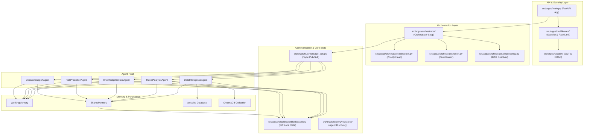
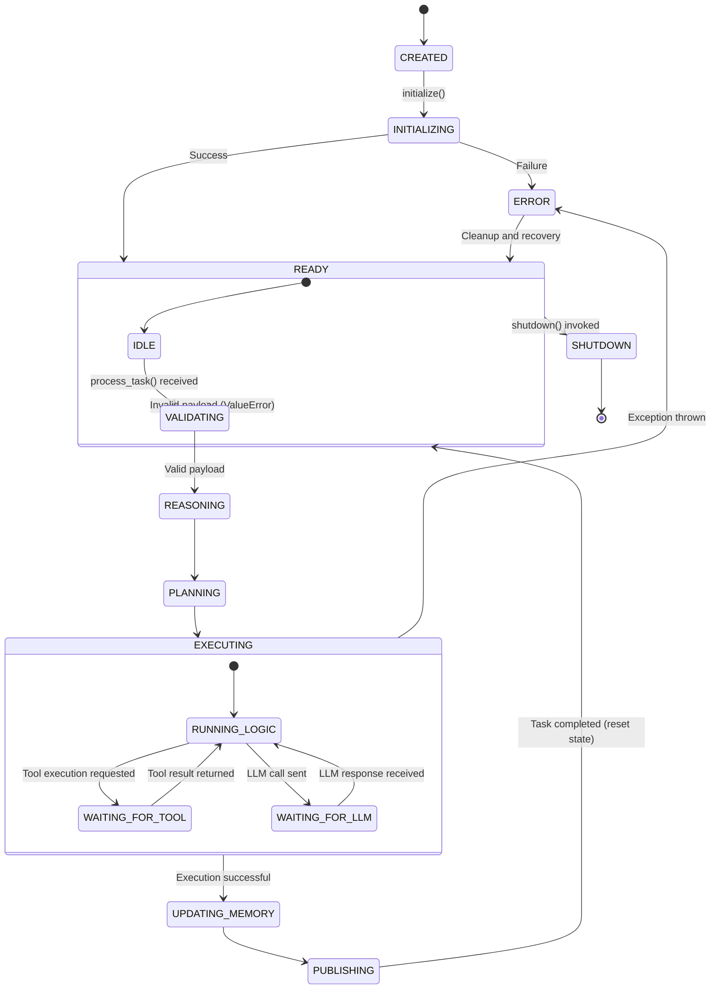
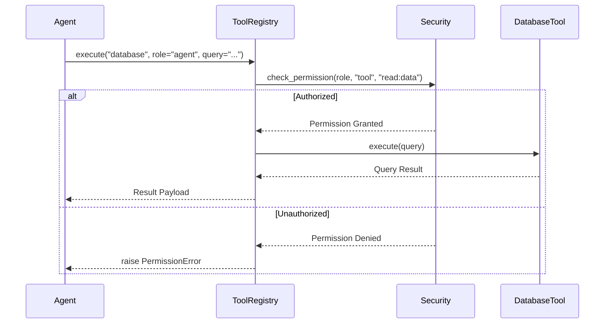

# ARGUS MASTER SPECIFICATION
## Autonomous Risk-aware Grid Understanding & Security

### Document Metadata
- **Version**: 1.0.0
- **Status**: APPROVED
- **Author**: Chief Software Architect
- **Approved By**: ARGUS Architecture Board
- **Last Updated**: 2026-07-05
- **Reference ID**: ARGUS-SPEC-00

---

## 1. Document Control

### 1.1 Revision History

| Version | Date | Author | Description | Status |
| :--- | :--- | :--- | :--- | :--- |
| 1.0.0 | 2026-07-05 | Chief Architect | Initial release of Master Specification | Approved |

### 1.2 Reviewers & Approvals

| Name | Role | Department | Action | Date |
| :--- | :--- | :--- | :--- | :--- |
| ARGUS Board | Architecture Review | Security & AI Engineering | Approved | 2026-07-05 |
| Tech Lead | Technical Sign-off | Grid Infrastructure Security | Approved | 2026-07-05 |

### 1.3 Scope of Revision
This document sets the definitive engineering requirements for the entire ARGUS platform. It covers:
- Core multi-agent abstractions and schemas
- Security and compliance boundaries
- Communication interfaces (Blackboard and Message Bus)
- Frontend, database, and orchestration specifications

---

## 2. Executive Summary

### 2.1 Purpose
ARGUS (Autonomous Risk-aware Grid Understanding & Security) is an AI-powered cybersecurity platform built specifically to protect Smart Grid Infrastructure (SCADA networks, IoT substation telemetry, and distribution management systems). It utilizes a collaborative, decoupled multi-agent system to ingest telemetry, correlate events with threat databases, evaluate systemic risk factors, and construct optimal mitigation plans.

### 2.2 Vision
To establish a self-defending energy grid monitoring system where specialized AI agents continuously audit, correlate, and defend physical power components against complex cyber-physical attacks.

### 2.3 Mission
Build a robust, secure, and resilient platform framework that decouples the coordination logic from AI models, allowing standard and advanced security analysis models to run as interchangeable agents.

### 2.4 Scope of the Platform
- **In Scope**: Ingestion of SCADA logs and telemetry, MITRE ATT&CK correlation, dynamic vulnerability check, graph-based asset tracking, risk calculation, dashboard UI visualization, and human-in-the-loop recommendation approvals.
- **Out of Scope (Phase 1)**: Automatic execution of critical infrastructure changes (e.g. breakers tripping) without operator authorization; raw AI model training (agents rely on pre-trained LLMs and local logic).

---

## 3. System Goals

### 3.1 Primary Goals
1. **Low Latency Alert Ingestion**: Event-to-analysis pipeline must complete under 2 seconds.
2. **Deterministic Security Controls**: Explicit role-based access control (RBAC) checking for every tool run.
3. **Decoupled Agent Architecture**: Zero direct agent-to-agent communication; all state must reside in the shared Blackboard or pass through the Message Bus.
4. **Resiliency**: Circuit breaker isolation for external services, database repositories, and API clients.

### 3.2 Success Criteria

| Metric | Target Value | Verification Method |
| :--- | :--- | :--- |
| Blackboard Write Time | < 10ms | Simulated high-throughput performance tests |
| CPU Usage per Agent | < 15% (idle) | Continuous system monitoring tests |
| Injection Mitigation Rate| > 99.5% | Prompt injection red-teaming validation |
| API Response Time | < 50ms (average) | Load testing tools (e.g., Locust) |

---

## 4. System Overview

### 4.1 Layered Architecture Diagram



---

## 5. Architecture Principles

### 5.1 Single Responsibility
Each agent, tool, and service must have a single, well-defined duty. This simplifies testing, limits failure domains, and enables independent model swapping.

### 5.2 Blackboard Pattern
Agents publish findings to a globally shared memory structure with read-write locks (`ReadWriteLock`). Subclasses are prohibited from reading or modifying the internal memory of other agents directly.

### 5.3 Dependency Injection (DI)
All database sessions, configuration instances, and core infrastructure interfaces (`IMessageBus`, `IBlackboard`, etc.) must be injected at construction time. This ensures modules can be mocked during testing.

### 5.4 Stateless Execution
Agents should maintain minimal runtime state outside of the standard memory structures (Working Memory, Vector Memory). If an agent fails and restarts, it must be able to restore context by querying the Blackboard.

---

## 6. Technology Standards

### 6.1 Backend Stack
- **Runtime**: Python 3.12
- **API Framework**: FastAPI with Uvicorn (lifespan managed)
- **Database (Relational)**: SQLite via `aiosqlite` and SQLAlchemy for local configuration, tasks, and audit logs.
- **Vector Search**: ChromaDB (locally persisted collection) for semantic threat database queries and logs.
- **AI Tooling**: Google Agent Development Kit (ADK) adapter wrapper.

### 6.2 Frontend Stack
- **Framework**: React 19 + TypeScript + Vite
- **Styling**: Tailwind CSS v4 using customized utility CSS properties
- **Routing**: `react-router-dom` v7
- **UI Architecture**: Component-driven design using custom shadcn-inspired components

---

## 7. Folder Structure Specification

```
ARGUS/
├── config/                 # Platform configuration (YAML & Pydantic settings)
│   ├── agents.yaml         # Agent capacity and capability parameters
│   ├── settings.py         # Root Pydantic settings schema loader
│   └── tools.yaml          # Configured rate limits and timeouts for tools
├── src/
│   └── argus/
│       ├── agents/         # BaseAgent implementations (DataIntelligence, etc.)
│       ├── api/            # FastAPI Routers and WebSocket controllers
│       ├── blackboard/     # Shared state models, locks, and partitions
│       ├── bus/            # Event-driven message bus
│       ├── core/           # Base contracts (exceptions, enums, protocols)
│       ├── database/       # SQLAlchemy engine and session configurations
│       ├── memory/         # Working, Shared, Vector, and Cache memories
│       ├── orchestrator/   # Task scheduler, router, and DAG engine
│       ├── security/       # JWT Auth, RBAC, rate-limiting, and audit logs
│       ├── tools/          # ToolRegistry and concrete Tool implementations
│       └── utils/          # Universal serializers, identifiers, and crypto
└── frontend/               # React Dashboard workspace
    ├── src/
    │   ├── components/     # UI elements (layout, dashboard, shared)
    │   ├── lib/            # Utilities (cn.ts tailwind merger)
    │   ├── pages/          # Full page views (Dashboard.tsx)
    │   └── main.tsx        # React client entry point
```

---

## 8. Agent Architecture

### 8.1 Data Intelligence Agent
- **Purpose**: Normalization and alignment of real-time SCADA and IoT sensor telemetry.
- **Allowed Tools**: `database`, `filesystem`.
- **Forbidden Responsibilities**: Threat classification or severity calculations.
- **Inputs**: Raw grid telemetry payload.
- **Outputs**: Normalized telemetry logs posted to `BlackboardSection.SHARED_CONTEXT`.

### 8.2 Threat Analysis Agent
- **Purpose**: Correlation of normalized logs against MITRE ATT&CK patterns.
- **Allowed Tools**: `mitre`, `cve`.
- **Forbidden Responsibilities**: Generating network mitigation actions.
- **Inputs**: Normalized logs from Data Intelligence.
- **Outputs**: Confirmed threat events posted to `BlackboardSection.THREAT_RESULTS`.

### 8.3 Knowledge & Context Agent
- **Purpose**: Enrichment of threat findings with historical asset database context.
- **Allowed Tools**: `database`.
- **Forbidden Responsibilities**: Direct risk scoring or decision recommendations.
- **Inputs**: Active threat indicators.
- **Outputs**: Detailed asset context models posted to `BlackboardSection.KNOWLEDGE_RESULTS`.

### 8.4 Risk Prediction Agent
- **Purpose**: Calculation of dynamic security impact scores.
- **Allowed Tools**: `database`.
- **Forbidden Responsibilities**: Formulating response plans.
- **Inputs**: Active threat payloads and asset contexts.
- **Outputs**: Dynamic risk assessment vectors posted to `BlackboardSection.RISK_RESULTS`.

### 8.5 Decision Support Agent
- **Purpose**: Generation of human-in-the-loop mitigation plans.
- **Allowed Tools**: `api`.
- **Forbidden Responsibilities**: Raw data validation or event parsing.
- **Inputs**: System risk profile.
- **Outputs**: Actionable recommendation list posted to `BlackboardSection.DECISION_RESULTS`.

---

## 9. Master Agent Contract

Every agent class MUST inherit from `BaseAgent` and implement the 10 lifecycle methods. Below is the mandatory interface contract:

```python
class BaseAgent(ABC):
    def __init__(
        self,
        agent_id: str,
        name: str,
        version: str,
        description: str,
        capabilities: List[str],
        permissions: List[str],
        tools: List[str],
        *,
        blackboard: Optional["IBlackboard"] = None,
        message_bus: Optional["IMessageBus"] = None,
        tool_registry: Optional[Any] = None,
        working_memory: Optional["IMemoryStore"] = None,
        shared_memory: Optional["IMemoryStore"] = None,
        vector_memory: Optional[Any] = None,
        cache: Optional[Any] = None,
        security: Optional["ISecurityProvider"] = None,
    ):
        ...
```

### 9.1 Required Lifecycle Implementation
Subclasses must fully implement:
1. `initialize()`: Verify connection to vector search collections or telemetry queues.
2. `validate(input_data)`: Inspect schemas via custom Pydantic validators.
3. `reason(context)`: Process current observations and context database queries.
4. `plan(reasoning)`: Formulate steps for local tool execution.
5. `execute(plan)`: Coordinate actions, executing tools through `ToolRegistry`.
6. `call_tools(tool_requests)`: Invoke required APIs with active credentials.
7. `update_memory(result)`: Save to WorkingMemory and VectorMemory.
8. `publish(result)`: Push to Blackboard and publish event schema messages.
9. `health()`: Return runtime performance statistics and heartbeat updates.
10. `shutdown()`: Safely close database connections and write final state logs.

---

## 10. Agent State Machine

The agent lifecycle states are structured according to the diagram below:



---

## 11. Message Protocol

Event messages exchanged on the `MessageBus` must inherit from `BaseMessage` and strictly conform to JSON schemas.

### 11.1 Message Schema Specification

| Field | Type | Description |
| :--- | :--- | :--- |
| `request_id` | `str` | Unique tracking identifier (UUIDv4 format) |
| `trace_id` | `str` | Request correlation ID across all services |
| `agent_id` | `str` | Producing agent identifier |
| `timestamp` | `datetime` | ISO 8601 string in UTC timezone |
| `payload` | `dict` | Event-specific data body |
| `version` | `str` | Schema version identifier (e.g. "1.0.0") |

### 11.2 Example Event Schema: `ALERT_EVENT`

```json
{
  "request_id": "9b1deb4d-3b7d-4bad-9bdd-2b0d7b3dcb6d",
  "trace_id": "ca761234-a123-4567-a890-bcde12345678",
  "agent_id": "threat-analysis-agent-01",
  "timestamp": "2026-07-05T11:08:27Z",
  "priority": "HIGH",
  "payload": {
    "alert_id": "ALT-2026-0045",
    "source_component": "substation_A_scada",
    "threat_type": "MitM_Telemetry_Spoofing",
    "severity": 0.88,
    "mitre_technique_id": "T0831",
    "description": "Observed cyclic frequency deviation on bus coupling relay."
  },
  "version": "1.0.0"
}
```

---

## 12. Dataset Specification

### 12.1 Authorized Telemetry Datasets
1. **SCADA Sensor Logs**: Telemetry metrics (voltage, frequency, bus indicators) for baseline modeling and anomaly detection validation.
2. **MITRE ATT&CK ICS Matrix**: Declarative attack technique definitions loaded locally in JSON format to support Threat Analysis correlations.
3. **CVE National Vulnerability Database**: Structured CVE metadata records parsed by search tools to link asset contexts with known vulnerability records.

### 12.2 Data Quality & Validation Rules
- Telemetry timestamps must use UTC timezone format.
- Numeric attributes must fail validation if values fall outside physical sanity bounds (e.g., negative frequency parameters).
- Prompt values must be scanned for injection signatures before processing.

---

## 13. Feature Ownership Matrix

To prevent coordination conflicts, agent processing domains are strictly isolated:

| Feature Area | Data Intelligence | Threat Analysis | Knowledge Context | Risk Prediction | Decision Support |
| :--- | :---: | :---: | :---: | :---: | :---: |
| Telemetry Ingestion | **Owner** | - | - | - | - |
| Telemetry Parsing | **Owner** | - | - | - | - |
| Anomaly Matching | - | **Owner** | - | - | - |
| ATT&CK Vector Link | - | **Owner** | - | - | - |
| Substation Map Lookup | - | - | **Owner** | - | - |
| Historical Lookup | - | - | **Owner** | - | - |
| Component Risk Weight | - | - | - | **Owner** | - |
| Cascade Failure Prediction | - | - | - | **Owner** | - |
| Recommendations | - | - | - | - | **Owner** |
| Approval Pipeline | - | - | - | - | **Owner** |

---

## 14. Tool Architecture

Every tool must be registered in the `ToolRegistry` and checked against agent permissions:



---

## 15. Memory Architecture

The memory hierarchy of the ARGUS agents utilizes five distinct operational scopes:

```
[Telemetry Ingestion]
         │
         ▼
 ┌───────────────┐
 │ WorkingMemory │ ──► (Per-Agent Ephemeral Scratchpad)
 └───────────────┘
         │
         ▼
 ┌───────────────┐
 │ SharedMemory  │ ──► (Delegates to Blackboard SHARED_CONTEXT section)
 └───────────────┘
         │
         ▼
 ┌───────────────┐
 │  TTLCache     │ ──► (Lazy-eviction Cache; default 300s window)
 └───────────────┘
         │
         ▼
 ┌───────────────┐
 │ VectorMemory  │ ──► (Local ChromaDB collection for logs search)
 └───────────────┘
         │
         ▼
 ┌───────────────┐
 │PersistentMem  │ ──► (aiosqlite Database for historical logs)
 └───────────────┘
```

---

## 16. Security Policy

### 16.1 Prompt Injection Defense
- **Regex Filter Engine**: Scan all text payloads against common adversarial triggers ("ignore instructions", "you are now", "forget what I told you").
- **Classification Engine**: If a confidence threshold exceeds `0.80`, raise `InjectionDetectedError` and write to the audit repository.

### 16.2 Secret Management
- Secrets and API keys must be loaded from Pydantic `BaseSettings` initialized via system environment variables.
- Raw API keys must never be committed to repository code or output to standard logging streams.

---

## 17. Coding Standards

### 17.1 Python
- Strict conformity to PEP 8 standards. Maximum line length is set to 100 characters.
- Strict type hinting checked via `mypy` configuration. All parameter variables and return types must be declared.
- Asynchronous patterns must use native `async`/`await` commands exclusively. Synchronous thread blocking calls (like file I/O) are prohibited.

### 17.2 React & TypeScript
- functional components with TypeScript interface declarations for Props and State.
- Clean Tailwind utility layouts. Inline styling configurations are prohibited.

---

## 18. API Standards

### 18.1 REST Guidelines
- All endpoint responses must use the generic `APIResponse[T]` schema.
- Paginated routes must use `PaginatedResponse[T]` containing metadata keys.
- Versioning is strictly path-based: `/api/v1/`.

### 18.2 WebSocket Guidelines
- WebSocket dashboard controller is mounted at `/ws/dashboard`.
- Heartbeat pings must execute every 30 seconds. Inactive connections must be closed after 60 seconds of inactivity.

---

## 19. Logging Standards

- Production mode must output structured JSON formatting.
- Correlation IDs (`trace_id`) must be propagated through all API calls, middleware, and message bus queues.
- Security-critical events must be logged with the prefix `AUDIT_EVENT_` and include user/agent identity metadata.

---

## 20. Performance Standards

| Parameter | Limit | Verification Method |
| :--- | :--- | :--- |
| API Endpoint Latency | < 50ms | HTTP benchmarks |
| DB Query Isolation | < 10ms | Database connection metrics |
| Blackboard Lock Time | < 5ms | Concurrency benchmarks |
| Process Memory footprint| < 512MB | Docker resource limits |

---

## 21. Testing Standards

- **Unit Testing**: Target 80%+ coverage, writing mock drivers using `unittest.mock`.
- **Integration Testing**: Test asynchronous flows (e.g. Bus publishes to Registry, which routes to Agent) within the test suite database.
- **Continuous Integration (CI)**: GitHub Actions run format checks, static checks, and unit tests on every Pull Request.

---

## 22. Deployment Standards

- Production containers must run as non-root users inside distroless base images.
- Databases must use persisted volume mounts configured under `/var/lib/argus/`.
- Dynamic configurations must utilize `ARGUS_` environment variables mapped inside `docker-compose.yml`.

---

## 23. Development Workflow

- The main repository branch is `main`. All development must occur on separate feature branches (format: `feature/ticket-description`).
- Commit messages must conform to semantic commit specifications (e.g. `feat: ...`, `fix: ...`, `chore: ...`).
- Merging to `main` requires a green CI pipeline, passing unit tests, and code review approval.

---

## 24. Roadmap

```
[Phase 1: Foundation]
  - Complete abstractions (Blackboard, Bus, Registries, Security)
  - React v19 UI Dashboard integration
  - Stub Agents and mock Tools
         │
         ▼
[Phase 2: Real Integrations]
  - Real SCADA dataset integration
  - Production database engine deployment
  - Live Gemini API integrations
         │
         ▼
[Phase 3: Automated Mitigations]
  - Local fallback model configurations
  - Production-ready MCP server installations
  - Cloud Kubernetes deployment
```

---

## 25. Glossary

- **SCADA**: Supervisory Control and Data Acquisition. Systems used to monitor and control industrial infrastructure.
- **Blackboard**: A shared, concurrent-safe memory architecture partitioned into logical segments where cooperative agents publish observations.
- **Message Bus**: An asynchronous event distribution channel that uses topic-based routing for inter-component coordination.
- **Google ADK**: Agent Development Kit. An API framework used for developing and orchestrating LLM agents.
- **ChromaDB**: An embeddable vector database used to store and query semantic documents.
- **RBAC**: Role-Based Access Control. An access control system that links system capabilities to user permissions.
