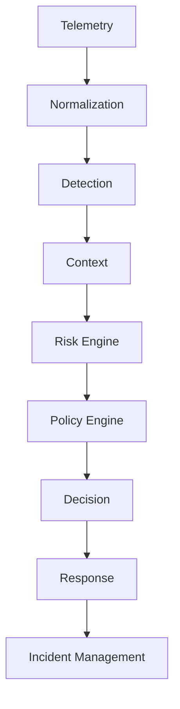

# Professional Architecture Audit: ARGUS Framework

## 1. Current Architecture
The current implementation reflects a research-oriented Multi-Agent System (MAS) coordinated by a central Orchestrator (`src/argus/orchestrator/orchestrator.py`). Agents (`Data Intelligence`, `Threat Analysis`, `Knowledge Context`, `Risk Prediction`, `Decision Support`) interact asynchronously via a message bus and blackboard pattern. The backend is exposed via a FastAPI application (`src/argus/api/main.py`). The frontend connects via REST and WebSocket.

## 2. Current Data Flow
1. **Input**: Threat Analysis agent (detector) ingests features and runs inference using LightGBM/XGBoost.
2. **Contextualization**: Knowledge Context agent fetches playbook, MITRE ATT&CK, and CISA advisories.
3. **Risk Scoring**: Risk Prediction agent analyzes asset criticality and impact, emitting a `RiskEvent`.
4. **Decision**: Decision Support agent maps the `RiskEvent` to action recommendations, generating a `DecisionEvent`.
5. **Output**: The frontend API presents the generated traces, statuses, and decisions.

## 3. Current Service Responsibilities
- **Threat Analysis Agent**: ML inference (XGBoost/LightGBM), thresholding, and anomaly scoring.
- **Knowledge Context Agent**: Enriches anomalies with LLM-based reasoning (Gemini) and threat intelligence.
- **Risk Prediction Agent**: Computes business/operational risk scores based on asset priorities.
- **Decision Support Agent**: Determines required actions, evaluates impact, and asserts if Human-In-The-Loop (HITL) approval is needed.
- **Orchestrator**: Routes tasks to capable agents, manages dependencies, and tracks execution state.

## 4. Current Weaknesses & Gap Analysis
### A. Where risk and decision logic are currently coupled
**[HIGH]** Risk and decision logic interact via loosely coupled events (`RiskEvent` -> `DecisionEvent`), but Policy enforcement is implicitly buried inside the `DecisionSupportAgent`'s playbook tools instead of a centralized Policy Engine.
### B. Whether the LLM can currently influence a security action directly
**[LOW]** The LLM (`gemini_reasoner`) is appropriately constrained to the Threat Analysis and Knowledge Context agents. It provides reasoning strings but is structurally separated from the `DecisionSupportAgent`, ensuring it cannot independently force an action.
### C. Whether deterministic policy rules exist
**[CRITICAL]** There is no explicit Policy Engine or deterministic rule evaluation engine (e.g., OPA). Decisions rely on embedded logic within tools.
### D. Whether the system has a standardized event schema
**[LOW]** Good enforcement. Pydantic models (e.g., `RiskEvent`, `DecisionEvent`) act as strict input/output contracts across the message bus.
### E. Whether agent interfaces have explicit input/output contracts
**[LOW]** Implemented successfully via the `BaseAgent` paradigm (`reason`, `plan`, `execute`).
### F. Whether decisions are auditable
**[MEDIUM]** An `AuditRecord` SQLAlchemy model exists, providing a basic framework, but end-to-end cryptographic provenance of decisions is lacking.
### G. Whether incident lifecycle exists
**[CRITICAL]** Missing. There are no database tables or schemas tracking incidents (`IncidentManagement`). The system treats each alert as a stateless task.
### H. Whether model/version provenance exists
**[HIGH]** Model binaries are loaded via `hashlib` in `model_loader.py`, but there is no systemic registry tracking provenance in the database.
### I. Whether frontend uses real backend APIs
**[MEDIUM]** The frontend uses a real API base URL, but endpoints appear heavily coupled to the agent testing phase (`processAlert`).
### J. Whether backend services can be independently tested
**[LOW]** Well-structured unit and integration tests exist under `tests/`.
### K. Whether failures in one service propagate safely
**[HIGH]** The orchestrator catches loop errors, but lacks a distributed dead-letter queue or Saga pattern for handling partial failures during high-stakes security operations.
### L. Whether the current architecture supports human approval before high-impact actions
**[LOW]** Fully supported via `ApprovalGenerator` which sets the `approval_required` flag in the `DecisionEvent`.
### M. Whether production code contains hardcoded scientific parameters
**[HIGH]** `confidence_threshold` and other variables are hardcoded in agent configurations (`argus/agents/threat_analysis/config.py`).

## 5. Target Architecture
The platform must migrate to a mature pipeline:
`Telemetry -> Normalization -> Detection -> Context (Asset, Threat Intelligence, Explainability, Historical evidence) -> Risk Engine -> Policy Engine -> Decision -> Response -> Incident Management`

## 6. Gap Analysis Summary
- **Normalization**: Lacks a dedicated data normalization layer (currently mixed in data intelligence/detector).
- **Policy Engine**: Missing. Must be introduced before the Decision phase.
- **Response Layer**: Missing. Decisions are recommended but not executed.
- **Incident Management**: Missing. No stateful incident tracking exists.

## 7. Dependency Graph

## 8. Recommended Implementation Order
(See section at the end of the document)

## 9. Components that must NOT be changed
- The `src/argus/agents/threat_analysis` underlying core ML integrations (to preserve Phase 4 validation).
- Existing test suites validating the cross-domain functionality.
- The `gemini_reasoner` bounding inside the context layers.

## 10. Components safe to refactor
- `src/argus/agents/decision_support` (to strip out policy logic).
- `src/argus/api/main.py` (to support proper RESTful incident/policy endpoints).
- `src/argus/database/models.py` (to add Incident, Policy, and Provenance models).

## 11. Risks of each proposed change
- **Introducing a Policy Engine**: May break existing integration tests that expect `DecisionSupportAgent` to output final approvals.
- **Incident Management**: Introduces complex state management, risking race conditions if the orchestrator is not updated to handle stateful incidents.
- **Refactoring Normalization**: High risk of breaking the precise feature representations required by the XGBoost/LightGBM models.

---

Recommended implementation sequence:
1. Implement Policy Engine and decouple policy logic from Decision Support Agent.
2. Implement Incident Management database models and lifecycle services.
3. Implement Response Execution layer to ingest Decisions.
4. Extract Normalization into a dedicated preprocessing microservice.
5. Migrate hardcoded scientific configurations to the database.
