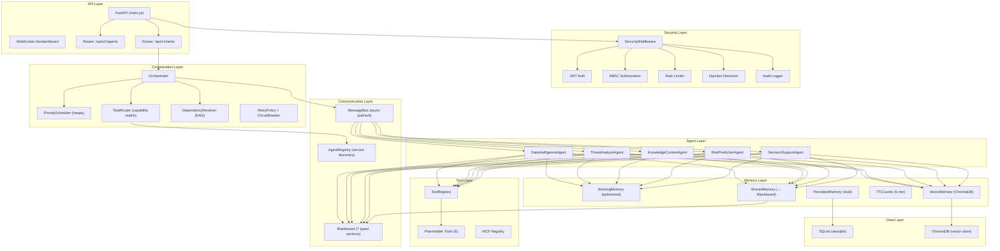
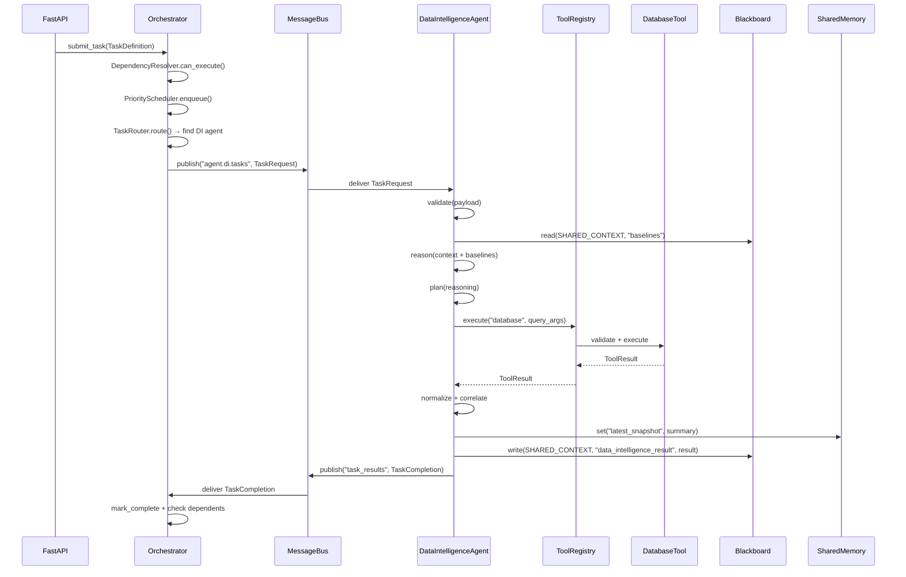

# ARGUS Architecture Analysis — Deep Dive

> **Scope**: Read-only analysis. No code was generated or modified.
> **Goal**: Understand exactly how a production `DataIntelligenceAgent` should integrate into the existing system.

---

## 1. Current Architecture Summary

### 1.1 High-Level Topology



### 1.2 Design Patterns in Use

| Pattern | Where | Purpose |
|---------|-------|---------|
| **Template Method** | `BaseAgent.process_task()` | Fixed lifecycle skeleton; subclasses fill abstract steps |
| **Blackboard** | `Blackboard` + 7 `BlackboardSection`s | Inter-agent shared state with typed partitions |
| **Pub/Sub** | `MessageBus` | Decoupled async event-driven communication |
| **Protocol (Structural Typing)** | `IMessageBus`, `IBlackboard`, `IRegistry`, `IOrchestrator`, `IMemoryStore`, `ISecurityProvider` | Loose coupling; no ABC inheritance required |
| **Repository** | `BaseRepository[T]` | Generic async CRUD abstraction |
| **Strategy** | `BaseTool` subclasses | Interchangeable tool implementations |
| **Service Discovery** | `AgentRegistry` | Capability-based agent lookup |
| **DAG Resolution** | `DependencyResolver` | Task dependency ordering with cycle detection |
| **Circuit Breaker** | `CircuitBreaker` | Fault isolation (3-state: closed → open → half-open) |
| **Optimistic Concurrency** | `VersionedEntry` | Version-checked writes with conflict detection |
| **Read-Write Lock** | `ReadWriteLock` per section | Concurrent reads, exclusive writes |

### 1.3 Configuration Architecture

| Source | Mechanism | Purpose |
|--------|-----------|---------|
| `.env` / env vars | `ArgusSettings` (Pydantic `BaseSettings`) | Runtime secrets & tuning knobs |
| `config/agents.yaml` | Declarative YAML | Per-agent model, timeout, tools, permissions, memory |
| `config/tools.yaml` | Declarative YAML | Per-tool timeout, rate limits, retry policy |
| `config/security.yaml` | Declarative YAML | RBAC role → permission mappings |
| `config/logging.yaml` | Declarative YAML | Structlog configuration |
| `config/feature_flags.yaml` | Declarative YAML | Feature toggles (e.g., `vector_memory`) |

### 1.4 Agent Lifecycle Contract

The `BaseAgent.process_task()` template method enforces this exact sequence:

```
validate(task_payload)
    │ raises ValueError if False
    ▼
reason(context)
    │ returns reasoning output
    ▼
plan(reasoning)
    │ returns execution plan
    ▼
execute(plan)
    │ returns result
    ▼
update_memory(result)
    │ persists state
    ▼
publish(result)
    │ writes to blackboard / bus
    ▼
return result
```

Status transitions: `READY → BUSY → READY` (success) or `READY → BUSY → ERROR` (failure).

> [!WARNING]
> **`call_tools()` is defined as abstract but NEVER called by `process_task()`.**
> There is only a comment `# Placeholder for tool calling logic`. Agents that need tools must invoke them within `execute()` directly, or `process_task()` must be extended.

---

## 2. Existing Reusable Modules

These modules are **production-ready infrastructure** that the Data Intelligence agent should consume directly — not rewrite.

### 2.1 Fully Implemented & Usable

| Module | File | What It Provides |
|--------|------|------------------|
| **MessageBus** | [message_bus.py](file:///home/bhumi/GitHub/ARGUS/src/argus/bus/message_bus.py) | Async pub/sub with DLQ, topic routing, metrics |
| **Blackboard** | [blackboard.py](file:///home/bhumi/GitHub/ARGUS/src/argus/blackboard/blackboard.py) | 7-section typed shared state with RW locks |
| **BlackboardSectionImpl** | [sections.py](file:///home/bhumi/GitHub/ARGUS/src/argus/blackboard/sections.py) | Versioned entries, TTL expiration, concurrency control |
| **ReadWriteLock** | [sync.py](file:///home/bhumi/GitHub/ARGUS/src/argus/blackboard/sync.py) | Async RW lock + optimistic `VersionedEntry` |
| **AgentRegistry** | [registry.py](file:///home/bhumi/GitHub/ARGUS/src/argus/registry/registry.py) | Registration, capability search, heartbeat monitoring |
| **WorkingMemory** | [working_memory.py](file:///home/bhumi/GitHub/ARGUS/src/argus/memory/working_memory.py) | Ephemeral per-agent key-value store |
| **SharedMemory** | [shared_memory.py](file:///home/bhumi/GitHub/ARGUS/src/argus/memory/shared_memory.py) | Inter-agent state via `SHARED_CONTEXT` blackboard section |
| **TTLCache** | [cache.py](file:///home/bhumi/GitHub/ARGUS/src/argus/memory/cache.py) | In-memory cache with lazy eviction (default 300s) |
| **VectorMemory** | [vector_memory.py](file:///home/bhumi/GitHub/ARGUS/src/argus/memory/vector_memory.py) | ChromaDB wrapper, feature-flagged, lazy-init |
| **PriorityScheduler** | [scheduler.py](file:///home/bhumi/GitHub/ARGUS/src/argus/orchestrator/scheduler.py) | Heapq priority queue with FIFO tiebreaking |
| **TaskRouter** | [router.py](file:///home/bhumi/GitHub/ARGUS/src/argus/orchestrator/router.py) | Capability intersection matching |
| **DependencyResolver** | [dependency.py](file:///home/bhumi/GitHub/ARGUS/src/argus/orchestrator/dependency.py) | DAG resolution with cycle detection |
| **RetryPolicy + CircuitBreaker** | [retry.py](file:///home/bhumi/GitHub/ARGUS/src/argus/orchestrator/retry.py) | Exponential backoff + fault isolation |
| **ToolRegistry** | [tool_registry.py](file:///home/bhumi/GitHub/ARGUS/src/argus/tools/tool_registry.py) | Permission-gated tool execution |
| **JWT Auth** | [auth.py](file:///home/bhumi/GitHub/ARGUS/src/argus/security/auth.py) | Token creation, verification, FastAPI dependency |
| **RBAC** | [authorization.py](file:///home/bhumi/GitHub/ARGUS/src/argus/security/authorization.py) | Role-permission checking, YAML-driven |
| **Audit Logger** | [audit.py](file:///home/bhumi/GitHub/ARGUS/src/argus/security/audit.py) | Structured security event logging |
| **Prompt Injection Detector** | [injection.py](file:///home/bhumi/GitHub/ARGUS/src/argus/security/injection.py) | Regex-based injection detection with confidence |
| **Rate Limiter** | [rate_limiter.py](file:///home/bhumi/GitHub/ARGUS/src/argus/security/rate_limiter.py) | Token bucket per-key rate limiting |
| **MetricsTracker** | [metrics.py](file:///home/bhumi/GitHub/ARGUS/src/argus/observability/metrics.py) | Counter/gauge tracking with tag support |
| **All Pydantic Schemas** | [schemas/*](file:///home/bhumi/GitHub/ARGUS/src/argus/schemas) | Message, Task, Agent, Blackboard, Tool, API, Security, Health, Metrics contracts |

### 2.2 Stubs That Need Real Implementation

| Module | File | Current State |
|--------|------|---------------|
| **PersistentMemory** | [persistent_memory.py](file:///home/bhumi/GitHub/ARGUS/src/argus/memory/persistent_memory.py) | All methods return `None`/`False` — needs SQLAlchemy integration |
| **ADK Adapter** | [adapter.py](file:///home/bhumi/GitHub/ARGUS/src/argus/integrations/adk/adapter.py) | Falls back to `agent.process_task()` — no real ADK usage |
| **Placeholder Tools** | [placeholder_tools.py](file:///home/bhumi/GitHub/ARGUS/src/argus/tools/placeholder_tools.py) | All return `{"status": "success", "mock_result": True}` |
| **API Routers** | [agents.py](file:///home/bhumi/GitHub/ARGUS/src/argus/api/routers/agents.py), [tasks.py](file:///home/bhumi/GitHub/ARGUS/src/argus/api/routers/tasks.py) | Return empty/None responses — not wired to real services |

---

## 3. Files That Should Be Extended

These are files where new code should be **added to** or **implementations filled in**, following existing patterns.

| File | What to Do | Why |
|------|------------|-----|
| [data_intelligence.py](file:///home/bhumi/GitHub/ARGUS/src/argus/agents/data_intelligence.py) | Replace all 10 stub methods with real logic | This IS the agent being implemented |
| [base_agent.py](file:///home/bhumi/GitHub/ARGUS/src/argus/core/base_agent.py) | Add optional infrastructure injection (`blackboard`, `message_bus`, `tool_registry`, `memory`) to `__init__` | Agents currently have **no way** to access shared infrastructure |
| [orchestrator.py](file:///home/bhumi/GitHub/ARGUS/src/argus/orchestrator/orchestrator.py) | Wire agent subscription: when an agent is registered, auto-subscribe it to its `agent.{id}.tasks` topic | Currently no agent subscription logic exists |
| [placeholder_tools.py](file:///home/bhumi/GitHub/ARGUS/src/argus/tools/placeholder_tools.py) | Replace `DatabaseTool` and `FileSystemTool` stubs with real implementations | DataIntelligence agent uses `database` and `filesystem` tools per config |
| [main.py](file:///home/bhumi/GitHub/ARGUS/src/argus/api/main.py) | Wire the lifespan startup to instantiate and register agents, blackboard, bus, orchestrator | Currently the startup hook just logs |

---

## 4. Files That Should NEVER Be Modified

These are stable contracts and infrastructure that other modules depend on. Changing them would break the entire system.

| File | Why It Must Not Change |
|------|----------------------|
| [base_agent.py](file:///home/bhumi/GitHub/ARGUS/src/argus/core/base_agent.py) — `process_task()` method | The template method defines the lifecycle contract; all 5 agents depend on it. Extending `__init__` is fine; modifying the lifecycle sequence is not. |
| [interfaces.py](file:///home/bhumi/GitHub/ARGUS/src/argus/core/interfaces.py) | Protocol contracts that the entire system codes against. Adding methods would break implementors. |
| [exceptions.py](file:///home/bhumi/GitHub/ARGUS/src/argus/core/exceptions.py) | Stable exception hierarchy. New subclasses can be added but existing classes must not change. |
| [enums.py](file:///home/bhumi/GitHub/ARGUS/src/argus/core/enums.py) | `BlackboardSection`, `AgentStatus`, `TaskStatus` are structural — adding members is safe, renaming/removing is not. |
| [types.py](file:///home/bhumi/GitHub/ARGUS/src/argus/core/types.py) | `AgentId`, `TaskId` etc. are used throughout. |
| [sync.py](file:///home/bhumi/GitHub/ARGUS/src/argus/blackboard/sync.py) | `ReadWriteLock` and `VersionedEntry` are concurrency primitives; modification risks data races. |
| [message_bus.py](file:///home/bhumi/GitHub/ARGUS/src/argus/bus/message_bus.py) | Core communication backbone. All agents and orchestrator depend on the pub/sub contract. |
| [blackboard.py](file:///home/bhumi/GitHub/ARGUS/src/argus/blackboard/blackboard.py) | Central shared state. API must remain stable. |
| [scheduler.py](file:///home/bhumi/GitHub/ARGUS/src/argus/orchestrator/scheduler.py) | Heap-based scheduler is a self-contained data structure. |
| [dependency.py](file:///home/bhumi/GitHub/ARGUS/src/argus/orchestrator/dependency.py) | DAG resolver with cycle detection. Algorithmically complete. |
| [auth.py](file:///home/bhumi/GitHub/ARGUS/src/argus/security/auth.py) | JWT token contract used by all API routes. |
| All files in [schemas/](file:///home/bhumi/GitHub/ARGUS/src/argus/schemas) | Pydantic models are shared contracts. Adding fields (with defaults) is safe; removing/renaming breaks serialization. |
| [settings.py](file:///home/bhumi/GitHub/ARGUS/config/settings.py) | Configuration schema. Adding new settings is safe; removing breaks startup. |
| [pyproject.toml](file:///home/bhumi/GitHub/ARGUS/pyproject.toml) | Dependency manifest. Adding deps is fine; removing breaks the build. |

---

## 5. Suggested Implementation Plan for Data Intelligence Agent

### 5.1 Critical Gap: Dependency Injection

Before any agent can be made "real", there is one structural problem that must be solved:

> [!CAUTION]
> **`BaseAgent.__init__()` does not accept infrastructure dependencies.**
> Agents have no reference to `blackboard`, `message_bus`, `tool_registry`, or any memory store.
> Without fixing this, agents cannot publish results, call tools, or share state.

**Recommended fix** — extend `BaseAgent.__init__()` with **optional** keyword arguments:

```python
# In BaseAgent.__init__, add after existing params:
blackboard: Optional["IBlackboard"] = None,
message_bus: Optional["IMessageBus"] = None,
tool_registry: Optional[Any] = None,
working_memory: Optional["IMemoryStore"] = None,
shared_memory: Optional["IMemoryStore"] = None,
vector_memory: Optional[Any] = None,
cache: Optional[Any] = None,
```

This is **additive** (does not break existing agent constructors since all are optional with `None` defaults) and follows the existing coding style.

### 5.2 Implementation Phases

#### Phase 0 — Dependency Wiring (prerequisite)

| Task | File | Description |
|------|------|-------------|
| Add optional infra params to BaseAgent | [base_agent.py](file:///home/bhumi/GitHub/ARGUS/src/argus/core/base_agent.py) | Add `blackboard`, `message_bus`, `tool_registry`, memory stores as optional `__init__` kwargs |
| Wire agent subscription in Orchestrator | [orchestrator.py](file:///home/bhumi/GitHub/ARGUS/src/argus/orchestrator/orchestrator.py) | When task is dispatched, agents need a handler subscribed to their topic |

#### Phase 1 — DataIntelligenceAgent Core Logic

Rewrite [data_intelligence.py](file:///home/bhumi/GitHub/ARGUS/src/argus/agents/data_intelligence.py) (currently 52 lines of stubs):

| Lifecycle Method | What It Should Do |
|-----------------|-------------------|
| `initialize()` | Load `config/agents.yaml` for `data_intelligence` config. Init `WorkingMemory`, `SharedMemory`, `TTLCache`. Optionally init `VectorMemory` if feature-flagged. Set status to `READY`. |
| `validate(input_data)` | Validate that `input_data` contains required keys (`source_type`, `data_payload`). Check `source_type` is one of `["scada", "iot", "network_log", "sensor"]`. Validate payload size via `security.validation.validate_payload_size()`. Return `bool`. |
| `reason(context)` | Analyze the validated input against current blackboard state. Read `SHARED_CONTEXT` for known baselines. Determine data anomalies, missing fields, and correlation candidates. Return a reasoning dict: `{"anomalies": [...], "correlations": [...], "confidence": float}`. |
| `plan(reasoning)` | Based on reasoning output, decide which tools to call and in what order. Return a plan list: `[{"step": "normalize", ...}, {"step": "correlate", ...}, {"step": "store", ...}]`. |
| `execute(plan)` | Execute each plan step. Call `DatabaseTool` via `tool_registry.execute("database", ...)` for data queries. Call `FileSystemTool` for log ingestion. Produce a normalized data record. Return structured result. |
| `call_tools(tool_requests)` | Iterate `tool_requests`, call `self.tool_registry.execute(req.tool_name, role="agent", **req.arguments)` for each. Return list of `ToolResult`s. |
| `update_memory(result)` | Store normalized data summary in `WorkingMemory`. Update `SharedMemory` with latest data snapshot for other agents. Optionally store in `VectorMemory` for semantic search. |
| `publish(result)` | Write result to `blackboard.write(BlackboardSection.SHARED_CONTEXT, "latest_data_intelligence", result, self.agent_id)`. Publish `TaskResult` to `message_bus.publish("task_results", result)`. |
| `health()` | Return `AgentHealthReport` with current status, tasks_completed, tasks_failed, memory usage, last_heartbeat. |
| `shutdown()` | Clear working memory. Log shutdown. Set status to `SHUTDOWN`. |

#### Phase 2 — Real Tool Implementations

Replace stubs in [placeholder_tools.py](file:///home/bhumi/GitHub/ARGUS/src/argus/tools/placeholder_tools.py):

| Tool | What It Should Do |
|------|-------------------|
| `DatabaseTool` | Execute async SQLAlchemy queries against the ARGUS SQLite DB using `database/session.py` |
| `FileSystemTool` | Read/parse local log files and SCADA data exports via `aiofiles` |

#### Phase 3 — Integration Testing

| Test | What It Validates |
|------|-------------------|
| Unit test `validate()` | Rejects malformed payloads, accepts valid ones |
| Unit test `reason()` | Produces correct anomaly structure from mock context |
| Unit test `execute()` | Calls the right tools in the right order |
| Integration test | Full `process_task()` cycle with real Blackboard and MessageBus |
| Blackboard test | Verify results appear in `SHARED_CONTEXT` section after `publish()` |

### 5.3 Files to Create vs. Extend

| Action | File | Rationale |
|--------|------|-----------|
| **EXTEND** | [base_agent.py](file:///home/bhumi/GitHub/ARGUS/src/argus/core/base_agent.py) | Add optional infra params to `__init__` |
| **REWRITE** | [data_intelligence.py](file:///home/bhumi/GitHub/ARGUS/src/argus/agents/data_intelligence.py) | Replace all stub methods with real logic |
| **EXTEND** | [placeholder_tools.py](file:///home/bhumi/GitHub/ARGUS/src/argus/tools/placeholder_tools.py) | Implement `DatabaseTool.execute()` and `FileSystemTool.execute()` |
| **NEW** | `src/argus/agents/schemas/data_intelligence_schemas.py` | Pydantic models for SCADA/IoT input validation |
| **NEW** | `tests/agents/test_data_intelligence.py` | Unit + integration tests |
| **DO NOT TOUCH** | Everything listed in Section 4 | Stable contracts and infrastructure |

### 5.4 Data Flow After Implementation



### 5.5 Key Constraints to Respect

1. **All methods must be `async`** — the entire architecture is asyncio-first
2. **Use `self.logger`** (structlog bound to agent context) — not `print()` or raw `logging`
3. **Use existing Pydantic schemas** for all message contracts — do not invent parallel models
4. **Write to `BlackboardSection.SHARED_CONTEXT`** — this is the designated section for inter-agent data sharing per the enum and existing `SharedMemory` implementation
5. **Tools must be called via `ToolRegistry`** — never bypass permission checks
6. **Respect the `process_task()` lifecycle** — do not override it; implement only the abstract methods
7. **Agent capabilities must match config** — `config/agents.yaml` declares `data_intelligence` tools as `["database", "filesystem"]` and permissions as `["data:read", "data:write"]`
8. **Feature flags matter** — check `settings.features.vector_memory` before using `VectorMemory`

---

## Summary of Critical Findings

> [!IMPORTANT]
> ### The #1 Architectural Gap
> `BaseAgent.__init__()` does not accept `blackboard`, `message_bus`, `tool_registry`, or memory stores as parameters. **No agent can interact with shared infrastructure until this is fixed.** This is the prerequisite for any real agent implementation.

> [!NOTE]
> ### The Positive
> The infrastructure layer (bus, blackboard, registry, orchestrator, scheduler, dependency resolver, security) is **well-designed and production-ready**. The agent implementation work is purely about filling in the business logic and wiring up the dependency injection — not rebuilding architecture.

> [!TIP]
> ### Recommended Order of Work
> 1. Fix `BaseAgent.__init__()` dependency injection (Phase 0)
> 2. Implement `DataIntelligenceAgent` lifecycle methods (Phase 1)
> 3. Implement real `DatabaseTool` and `FileSystemTool` (Phase 2)
> 4. Write tests (Phase 3)
