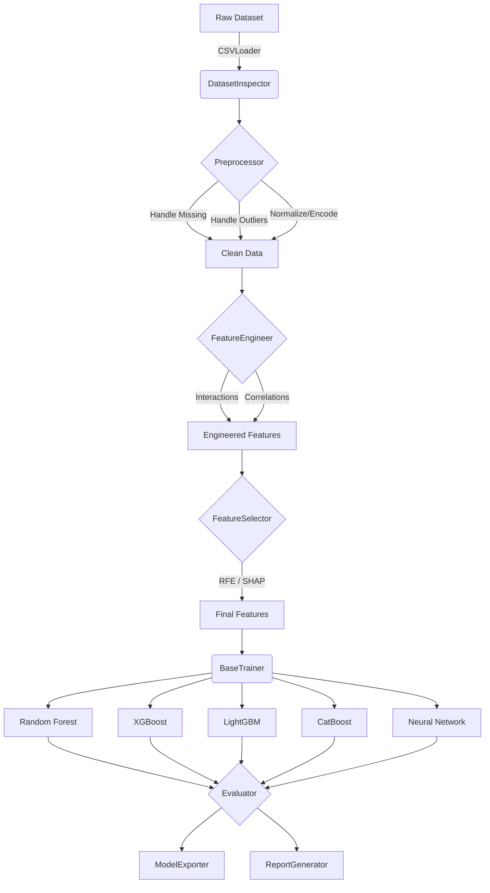

# ARGUS ML Training Framework

## Overview
The ARGUS ML Training Framework is a modular, production-ready machine learning pipeline designed for training threat detection models for the ARGUS platform. It supports multiple model architectures, robust configuration via YAML, and is built following SOLID principles for extreme extensibility.

## Architecture



## Folder Structure
```
training/
├── configs/                # YAML configs for default & specific models
├── data/                   # Data loading & inspection (CSVLoader)
│   ├── processed/          
│   └── raw/                # (e.g. nftoniotv2 dataset)
├── evaluation/             # Evaluator (Metrics, Cross-Validation)
├── exports/                # Saved models (Joblib, H5, ONNX)
├── feature_engineering/    # FeatureEngineer
├── feature_selection/      # FeatureSelector
├── graphs/                 # Output for matplotlib/seaborn plots
├── logs/                   # Structured structlog JSON logs
├── notebooks/              # Jupyter notebooks for EDA
├── preprocessing/          # Preprocessor pipeline
├── reports/                # HTML, Markdown, CSV metric reports
├── tests/                  # Pytest unit & integration tests
├── trainers/               # Model specific trainers inheriting BaseTrainer
└── utils/                  # ConfigManager, Logger, ExperimentTracker
```

## Supported Models
- **Random Forest** (sklearn)
- **XGBoost**
- **LightGBM**
- **CatBoost**
- **TensorFlow Neural Network**
- *Future*: GNN, Transformers

## Configuration
Configuration is driven by YAML. The `ConfigManager` loads `configs/default.yaml` first, then deeply merges the requested model's configuration (e.g., `configs/xgboost.yaml`) over it. 
- Overrides can also be passed via the CLI or Python dictionary.

## CLI Usage
The primary entry point is `train.py`.
**Note:** Execution is currently disabled. Use `--dry-run` to validate the framework.

```bash
# Validate Random Forest pipeline
python training/train.py --model random_forest --dry-run

# Validate all model pipelines
python training/train.py --all --dry-run
```

## Workflow
1. **Configure**: Select model and hyperparams via YAML.
2. **Load**: `CSVLoader` reads data (supports chunking for low RAM).
3. **Preprocess**: `Preprocessor` handles NaNs, outliers, encoding, and scaling.
4. **Engineer**: `FeatureEngineer` calculates MI, removes collinearity.
5. **Select**: `FeatureSelector` drops low-importance features via RFE/SHAP.
6. **Train**: `BaseTrainer` subclass executes `.fit()`.
7. **Evaluate**: `Evaluator` calculates F1, AUC-ROC, etc.
8. **Export**: `ModelExporter` saves weights and metadata.
9. **Report**: `ReportGenerator` builds markdown/HTML summaries.

## Hardware Requirements
Designed specifically for environments with strict constraints:
- **RAM**: 8GB Minimum (Supports chunked loading)
- **Compute**: CPU only (GPU optional for NN)
- **OS**: Windows / Linux / macOS

## Development & Testing
To run the framework tests:
```bash
python -m pytest training/tests/ -v
```
