# Decision Support Agent Software Design Document

## 1. Overview
The Decision Support Agent translates incoming risk assessments (`RISK_EVENT`) and context (`KNOWLEDGE_EVENT`) into actionable responses (`DECISION_EVENT`). By relying on standard operating procedures (SOPs), the agent identifies mitigation steps, sequences them by urgency and priority, and evaluates potential side-effects to determine if human-in-the-loop (HITL) approval is needed.

## 2. Decision Architecture
The architecture comprises six specialized `BaseTool` implementations orchestrated by the core `DecisionSupportAgent`:
- **Playbook Selector**: Filters available SOPs based on the severity of the risk and specific indicators (e.g., vulnerabilities).
- **Recommendation Engine**: Generates atomic `Recommendation` actions based on the selected playbooks.
- **Action Prioritizer**: Ranks actions based on global risk urgency and specific action types.
- **Impact Estimator**: Computes the expected operational downtime and risk reduction resulting from the action plan.
- **Approval Generator**: Assesses if the recommended actions necessitate human approval prior to autonomous execution (HITL).
- **Decision Publisher**: Broadcasts the finalized `DECISION_EVENT` via MessageBus and updates the Blackboard.

### Sequence Diagram

```mermaid
sequenceDiagram
    participant Orchestrator
    participant DecisionAgent
    participant PlaybookSelector
    participant RecommendationEngine
    participant MessageBus
    participant Blackboard

    Orchestrator->>DecisionAgent: process_task(DecisionAnalysisInput)
    DecisionAgent->>DecisionAgent: validate()
    
    rect rgb(30, 30, 30)
        Note over DecisionAgent: reason()
        DecisionAgent->>PlaybookSelector: execute()
        DecisionAgent->>RecommendationEngine: execute()
    end
    
    rect rgb(40, 40, 40)
        Note over DecisionAgent: plan()
        DecisionAgent->>ActionPrioritizer: execute()
        DecisionAgent->>ImpactEstimator: execute()
        DecisionAgent->>ApprovalGenerator: execute()
    end
    
    Note over DecisionAgent: execute() assembles DecisionEvent
    
    rect rgb(50, 50, 50)
        Note over DecisionAgent: publish()
        DecisionAgent->>MessageBus: publish("decision.events", DECISION_EVENT)
        DecisionAgent->>Blackboard: set("decision_results", DECISION_EVENT)
    end
```


## 3. Future AI Planning Architecture
The current implementation relies on rule-based heuristics inside the `RecommendationEngine`. The agent architecture is explicitly decoupled to support an upcoming migration to Large Language Model (LLM) based reasoning.

### Planned Integrations
1. **LLM Planner**: The `RecommendationEngine` will be replaced by an LLM-powered planning module (e.g., utilizing ReAct or Plan-and-Solve strategies). This planner will ingest the natural language description of the risk, combined with RAG-retrieved historical playbooks, to synthesize nuanced, novel defense strategies.
2. **Automated Playbook Orchestration**: Moving from static SOP IDs to dynamic YAML-based workflow schemas, enabling full automated orchestration engines (e.g., SOAR platforms) to ingest and execute the plans autonomously.
3. **Interactive HITL**: Evolving the `ApprovalGenerator` to pause execution, solicit active user input via Slack or a dashboard, and ingest the response back into the event stream before publishing the finalized event.

## 4. API Documentation

### Input Schema (`DecisionAnalysisInput`)
A composite structure comprising `RiskEventInput` and `KnowledgeContextInput`.
```json
{
  "risk_event": {
    "source_event_id": "string",
    "risk_score": 90,
    "severity": "CRITICAL",
    "confidence": 0.85
  },
  "knowledge_event": {
    "affected_assets": ["string"],
    "known_vulnerabilities": ["string"]
  }
}
```

### Output Schema (`DecisionEvent`)
The published DECISION_EVENT payload outlining the action plan.
```json
{
  "source_event_id": "evt-123",
  "recommended_actions": [
    {
      "action_type": "isolate_network",
      "target_assets": ["server1"],
      "priority": 1,
      "urgency": "immediate"
    }
  ],
  "priority": 1,
  "urgency": "immediate",
  "confidence": 0.85,
  "estimated_impact": {
    "total_expected_downtime_hours": 4.0,
    "services_disrupted": ["server1"],
    "risk_reduction_estimate": 0.9
  },
  "approval_required": true,
  "execution_plan": "Mitigate CRITICAL risk on 1 assets."
}
```
