# Knowledge & Context Agent (KCA)

## Overview
The Knowledge & Context Agent acts as the threat intelligence engine within the ARGUS platform. It consumes `THREAT_EVENT` alerts from the Blackboard, enriches them using multiple cybersecurity knowledge bases, and synthesizes a comprehensive `KNOWLEDGE_EVENT` that provides actionable context for downstream components (like the Risk Prediction and Decision Support agents).

The KCA is explicitly a **read-only enrichment service**. It does **not**:
- Detect attacks.
- Predict risk scores.
- Make automated containment decisions.
- Alter primary data streams.

## Architecture

The KCA employs a 9-stage pipeline to execute retrieval-augmented generation (RAG) using both deterministic local lookup and LLM-driven synthesis (via Gemini).

```mermaid
sequenceDiagram
    participant B as Blackboard
    participant A as KnowledgeContextAgent
    participant P as KnowledgePipeline
    participant T as Retrieval Tools
    participant G as GeminiReasoner
    
    B->>A: THREAT_EVENT (e.g. attack_type="brute_force")
    A->>P: process_threat(threat_data)
    
    rect rgb(30, 30, 30)
        Note over P, T: Stage 2-6: Parallel Retrieval
        P->>T: Query MITRE Enterprise
        P->>T: Query MITRE ICS
        P->>T: Query CVE Database
        P->>T: Query CISA Advisories
        P->>T: Query Playbooks
        T-->>P: RetrievalResults
    end
    
    P->>G: Synthesis (EnrichmentContext)
    Note over G: De-duplicate mitigations<br/>Compute confidence score<br/>Generate Markdown summary
    G-->>P: SynthesisResult
    
    P->>A: KnowledgeEvent
    A->>B: Publish KNOWLEDGE_EVENT
```



## Component Breakdown

- **Agent (`agent.py`)**: The primary ARGUS BaseAgent wrapper. Handles the standard `initialize -> validate -> reason -> plan -> execute -> publish` lifecycle.
- **Pipeline (`pipeline.py`)**: Orchestrates the internal workflow. Standardizes the incoming attack type and queries all configured tools.
- **Tools (`tools/`)**:
  - `mitre.py` / `mitre_ics.py`: MITRE ATT&CK knowledge bases.
  - `cve.py`: Critical Vulnerabilities and Exposures.
  - `cisa.py`: CISA ICS-CERT advisories for industrial control systems.
  - `playbook.py`: Internal Incident Response playbooks.
  - `gemini_reasoner.py`: Aggregates the retrieved context into a single structured output.
- **Resources (`resources/`)**: Local JSON databases containing domain-specific intelligence. Designed for easy migration to MCP-backed databases or ChromaDB in the future.

## Message Schemas

### Input: `THREAT_EVENT`
Requires at minimum:
```json
{
  "attack_type": "brute_force"
}
```

### Output: `KNOWLEDGE_EVENT`
Produces a robust schema mapping the threat to its broader context:
```json
{
  "event_type": "KNOWLEDGE_EVENT",
  "attack_context": {
    "attack_type": "brute_force",
    "primary_technique": "Brute Force"
  },
  "mitre_techniques": [...],
  "cves": [...],
  "cisa_advisories": [...],
  "recommended_mitigations": [
    "Implement Account Lockout Policies",
    "Require Multi-Factor Authentication"
  ],
  "confidence": 0.8
}
```
