# Risk Prediction Agent Software Design Document

## 1. Overview
The Risk Prediction Agent is a core component of the ARGUS platform, responsible for calculating cyber-physical risk scores by correlating active threat events with organizational knowledge and asset criticality. It operates strictly within the ARGUS `BaseAgent` lifecycle.

## 2. Risk Architecture
The architecture splits the risk prediction pipeline into modular, single-responsibility `BaseTool` implementations:
- **Critical Asset Analyzer**: Evaluates the priority of affected assets using the knowledge context.
- **Impact Estimator**: Estimates operational downtime and severity.
- **Trend Analyzer**: Evaluates historical attacks to calculate an escalation factor.
- **Risk Scorer**: Aggregates the inputs into a numeric risk score (0-100) and assigns a qualitative severity (e.g., HIGH, CRITICAL).
- **Confidence Calculator**: Calculates prediction confidence based on the originating threat confidence and context completeness.
- **Risk Publisher**: Broadcasts the output as a `RISK_EVENT` to the MessageBus and `IBlackboard`.

### Sequence Diagram

```mermaid
sequenceDiagram
    participant Orchestrator
    participant RiskAgent
    participant RiskScorer
    participant MessageBus
    participant Blackboard

    Orchestrator->>RiskAgent: process_task(RiskAnalysisInput)
    RiskAgent->>RiskAgent: validate()
    
    rect rgb(30, 30, 30)
        Note over RiskAgent: reason()
        RiskAgent->>CriticalAssetAnalyzer: execute()
        RiskAgent->>ImpactEstimator: execute()
        RiskAgent->>TrendAnalyzer: execute()
    end
    
    rect rgb(40, 40, 40)
        Note over RiskAgent: plan()
        RiskAgent->>RiskScorer: execute(criticality, impact, escalation)
        RiskScorer-->>RiskAgent: RiskScoreResult
        RiskAgent->>ConfidenceCalculator: execute()
    end
    
    Note over RiskAgent: execute() assembles RiskEvent
    
    rect rgb(50, 50, 50)
        Note over RiskAgent: publish()
        RiskAgent->>MessageBus: publish("risk.events", RISK_EVENT)
        RiskAgent->>Blackboard: set("risk_results", RISK_EVENT)
    end
```


## 3. Future ML Architecture
The current implementation utilizes rule-based heuristics inside the `RiskScorer` tool. The agent's decoupled architecture guarantees that future ML capabilities can be swapped in exclusively by overriding the `RiskScorer.execute()` logic without modifying the broader agent lifecycle.

### Planned Integrations
1. **Bayesian Networks**: For probabilistic risk scoring incorporating uncertainty from incomplete knowledge graphs. The `RiskScorer` will utilize libraries like `PyMC` to infer posterior risk probabilities.
2. **Graph Risk Models**: Utilizing Graph Neural Networks (GNNs) via `PyTorch Geometric` to traverse the ARGUS asset knowledge graph and predict cascading failures across substations.
3. **Digital Twins**: Querying state from digital twin simulations to provide empirical ground-truth impact estimations instead of static downtime matrices.

## 4. API Documentation

### Input Schema (`RiskAnalysisInput`)
A composite of `ThreatAnalysisResult` and `KnowledgeContext`.
```json
{
  "threat_event": {
    "source_event_id": "string",
    "threat_level": "string",
    "confidence": 0.0
  },
  "knowledge_event": {
    "affected_assets": ["string"],
    "asset_types": {"asset_id": "type"}
  }
}
```

### Output Schema (`RiskEvent`)
The final published event payload.
```json
{
  "source_event_id": "evt-123",
  "risk_score": 85,
  "severity": "HIGH",
  "confidence": 0.92,
  "asset_priority": "critical",
  "impact_estimation": {
    "severity": "severe",
    "estimated_downtime_hours": 12.0
  },
  "reasoning": "Asset Criticality: ... \n Impact: ... \n Final Risk: ..."
}
```
